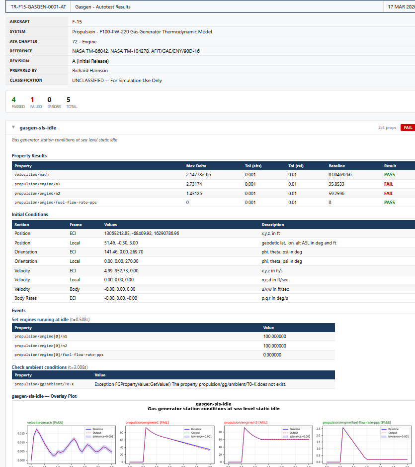
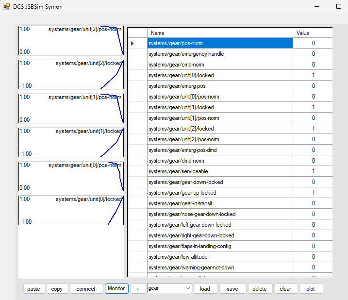

# acEFM
This permits the use of JSBSim models from with DCS World;
There must be a config file in the root of your mod; "aceFMconfig.xml" that sets the basic data (properties) and defines which JSBSim XML file to use. Usually the JSBSim XML will include other files (e.g. engines, systems).

* Required to use my JSBSim fork https://github.com/Zaretto/jsbsim.git using branch DCS-WIP-no-hacks (included as the `JSBSim/` git submodule)
* See https://github.com/Zaretto/DCS-SEPECAT-Jaguar for an example

## JSBSim integration

JSBSim is built as a **CMake-generated static library** (`libJSBSim` → `JSBSim.lib`) and linked into the EFM. The JSBSim tree stays pristine — there is no longer a hand-maintained `JSBSim.vcxproj` in the source tree.

* CMake source: `JSBSim/`  →  build tree: `build/JSBSim/` (generator *Visual Studio 17 2022*, platform `x64`, `BUILD_SHARED_LIBS=OFF`).
* CMake splits the build into one top-level project, `libJSBSim` (compiles only `FGFDMExec.cpp` + `JSBSim.cpp`), plus **14 sub-projects** that compile the rest and are linked in: `Atmosphere`, `FlightControl`, `GeographicLib`, `IOStreams`, `Init`, `InputOutput`, `Magvar`, `Math`, `Misc`, `Models`, `Properties`, `Propulsion`, `Xml`, and the `ZERO_CHECK` regeneration helper.
* `acEFM` and `TestPlane` reference `build\JSBSim\src\libJSBSim.vcxproj` as a project reference.
* **All of these CMake projects are added to `acEFM.sln`** (under the *JSBSim libs* solution folder). This is required for incremental build and debug: if only `libJSBSim` were in the solution, Visual Studio's up-to-date check would not notice edits to JSBSim sources (they belong to the sub-projects), so a build would do nothing and the debugger would report *"source file is out of date"*.

### Building and debugging JSBSim from the acEFM solution

* Open `acEFM.sln`, select **`Debug | x64`**, and build. To step into JSBSim source, you must use **Debug** — the `Release` / `JSBSimRelease` / `JSBSim64` solution configs map the JSBSim libs to optimised `Release|x64`.
* Set **TestPlane** as the startup project (DCS loads the DLL in-process, so TestPlane is the practical harness). Breakpoints in `JSBSim\src\...\*.cpp` are hit and you can step in.
* Editing the body of an existing JSBSim source file → just rebuild; only that file recompiles.
* **Adding / removing / renaming** a JSBSim source file, or editing any `CMakeLists.txt`, requires regenerating the CMake projects:
  ```
  cmake -S JSBSim -B build/JSBSim
  ```
  Project GUIDs are stable across regeneration, so the entries in `acEFM.sln` keep working.
* `cmake` and `msbuild` are not on `PATH` by default. Run the above from **"Developer PowerShell for VS"**, or use the copy bundled with Visual Studio:
  `…\Common7\IDE\CommonExtensions\Microsoft\CMake\CMake\bin\cmake.exe`.

## Platform / toolset versions

* The standard toolset is **`v143`** (**Visual Studio 2022** 17.x, **MSVC 14.44**). The CMake-generated JSBSim projects build with `v143`.
* On Richard's machine `acEFM` and `TestPlane` are locally bumped to PlatformToolset **`v145`** to test against **VS 2026 / v18**. This is a per-machine testing setting, **not** a project requirement — `v145` is not generally available, and without those build tools installed these projects fail with `MSB8020`. Retarget them back to `v143` on any machine that only has VS 2022.
* Mixing is safe to link: the `v14x` static-library ABI is stable across `v143`/`v145`, so a `v143` `JSBSim.lib` links cleanly into a `v145` `acEFM.dll`.
* To also compile/debug JSBSim itself under `v145`, regenerate the CMake build with that toolset:
  ```
  cmake -S JSBSim -B build/JSBSim -T v145
  ```

## acEFMconfig.xml DCS elements

### Cockpit API

acEFM supports the mapping between properties and the cockpit API `(pfn_ed_cockpit_update_parameter_with_number(Handle, val);` 

Nodes as follows
* `<param>` node defines the Handle to lookup
* `<property>` where the value comes from
* `<factor>` optional fixed factor to apply
* `<delta>` the amount the property must change before an update is trigged (optional, default 0.0001)
* `<type>` defines the type of the node which defines how the property value is handled prior to setting the value on the handle. Currently supported is the default type (nothing special) or `GenevaDrive` which will animation a Geneva Drive for instrument drums. `LinearDrive` is a linear drive. Only the default type is currently fully implemented.

```    <!-- bind all cockpit params -->
    <cockpit>
      <gauge>
        <param>Airspeed</param>
        <property>/fdm/jsbsim/velocities/vc-kts</property>
      </gauge>
      
      <gauge>
        <param>FuelFlow_Right</param>
        <property>/fdm/jsbsim/propulsion/engine[1]/fuel-flow-rate-pps</property>
        <factor>3600</factor>
      </gauge>
      ...
    </cockpit>
```

### Animations
The config file can contain an `<animation>` node that permits the mapping of draw arguments

### Draw arguments
You can define which properties are mapped to the **draw arguments** for your model. These will be set inside `ed_fm_set_draw_args` 

Nodes as follows
* `<param>` node defines the Handle to lookup
* `<property>` where the value comes from
* `<factor>` optional fixed factor to apply
* `<delta>` the amount the property must change before an update is trigged (optional, default 0.0001)

e.g. for afterburners.
```
    <animations>
      <drawarg n="28">
        <property>fdm/jsbsim/propulsion/engine[0]/augmentation-alight-norm</property>
        <delta>0.01</delta>
      </drawarg>
      <drawarg n="29">
        <property>fdm/jsbsim/propulsion/engine[1]/augmentation-alight-norm</property>
        <delta>0.01</delta>
      </drawarg>
    </animations>
```

### Commands

DCS passes pilot inputs to the EFM through `ed_fm_set_command(command, value)`, where `command` is a DCS *iCommand* code (e.g. `iCommandPlanePitch`, `iCommandPlaneThrustCommon`). acEFM maps these to JSBSim properties entirely through the config file — **there are no built-in command bindings**, so the `<commands>` section is required for throttle, flight controls and gear to work.

The iCommand codes are defined in `flyt-EFM-dcsJSBSim/iCommands.h`, generated from [DCS-OpenSource/LuaToolsPlugin](https://github.com/DCS-OpenSource/LuaToolsPlugin) (`iCommands.lua`).

Each `<command>` maps one iCommand to one JSBSim property. A command may appear multiple times to drive several properties (e.g. a common throttle feeding each engine).

Nodes as follows
* `<name>` the iCommand by name (e.g. `iCommandPlaneFlapsOn`), **or** `<icommand>` the numeric code — one of these is required
* `<property>` the JSBSim property to write
* `<value>` if present, this fixed value is written on every event (discrete commands — gear up/down, flaps on/off). When omitted, the command's own value is transformed:
  * `<factor>` scale applied to the incoming value (number, or a named constant such as `DEGREES_TO_RADIANS`; default `1`)
  * `<offset>` added after scaling (default `0`)
  * `<clip-min>` / `<clip-max>` optional output limits
* `<toggle>` if present (takes priority over `<value>`), the property is flipped between `0` and this value once per press, instead of being written directly — e.g. `<toggle>1</toggle>` toggles `0`↔`1`, `<toggle>100</toggle>` toggles `0`↔`100`. Empty/omitted value defaults to `1`. A press is detected as the incoming command value going from zero to non-zero; the release (back to zero) and repeat calls while held are ignored. Use this for single-key commands DCS treats as a toggle (e.g. `iCommandPlaneGear`) rather than a 2-position lever/switch (`iCommandPlaneGearUp`/`Down`, which should keep using `<value>`).

The transform is `out = clip(value * factor + offset, clip-min, clip-max)`. Set `/fdm/jsbsim/acefm/debug-commands` non-zero to log each applied binding.

```
    <commands>
      <!-- Throttle: DCS sends +1 (idle) .. -1 (full); JSBSim wants 0..1.
           One entry per engine for a common throttle. -->
      <command><name>iCommandPlaneThrustCommon</name><property>/fdm/jsbsim/fcs/throttle-cmd-norm[0]</property><factor>-0.5</factor><offset>0.5</offset><clip-min>0</clip-min><clip-max>1</clip-max></command>
      <command><name>iCommandPlaneThrustCommon</name><property>/fdm/jsbsim/fcs/throttle-cmd-norm[1]</property><factor>-0.5</factor><offset>0.5</offset><clip-min>0</clip-min><clip-max>1</clip-max></command>
      <command><name>iCommandPlaneThrustLeft</name><property>/fdm/jsbsim/fcs/throttle-cmd-norm[0]</property><factor>-0.5</factor><offset>0.5</offset><clip-min>0</clip-min><clip-max>1</clip-max></command>
      <command><name>iCommandPlaneThrustRight</name><property>/fdm/jsbsim/fcs/throttle-cmd-norm[1]</property><factor>-0.5</factor><offset>0.5</offset><clip-min>0</clip-min><clip-max>1</clip-max></command>

      <!-- Flight controls -->
      <command><name>iCommandPlanePitch</name><property>/fdm/jsbsim/fcs/elevator-cmd-norm</property><factor>-1.0</factor></command>
      <command><name>iCommandPlaneRoll</name><property>/fdm/jsbsim/fcs/aileron-cmd-norm</property></command>
      <command><name>iCommandPlaneRudder</name><property>/fdm/jsbsim/fcs/rudder-cmd-norm</property></command>

      <!-- Gear: single-key toggle, plus discrete up/down for a 2-position lever -->
      <command><name>iCommandPlaneGear</name><property>/fdm/jsbsim/gear/gear-cmd-norm</property><toggle>1</toggle></command>
      <command><name>iCommandPlaneGearDown</name><property>/fdm/jsbsim/gear/gear-cmd-norm</property><value>1.0</value></command>
      <command><name>iCommandPlaneGearUp</name><property>/fdm/jsbsim/gear/gear-cmd-norm</property><value>0.0</value></command>

      <!-- Flaps / airbrake on/off -->
      <command><name>iCommandPlaneFlapsOn</name><property>/fdm/jsbsim/fcs/flap-cmd-norm</property><value>1.0</value></command>
      <command><name>iCommandPlaneFlapsOff</name><property>/fdm/jsbsim/fcs/flap-cmd-norm</property><value>0.0</value></command>
      <command><name>iCommandPlaneAirBrakeOn</name><property>/fdm/jsbsim/fcs/speedbrake-cmd-norm</property><value>1.0</value></command>
      <command><name>iCommandPlaneAirBrakeOff</name><property>/fdm/jsbsim/fcs/speedbrake-cmd-norm</property><value>0.0</value></command>
    </commands>
```

## Folder structure

The main config files is **c:\users\YOU\Saved Games\DCS.openbeta\Mods\Aircraft\YOURMODEL\aceFMconfig.xml**. This defines all of the basic properties that the JSBSim XML requires and is where you can define what the draw arguments and cockpit animations.

JSBSim XML files 
* EFM/YOURMODEL.xml
* EFM/engines/
* EFM/systems/

e.g.

* efm\Engines
* efm\Systems
* efm\YOURMODEL-main-jsb.xml
* efm\Engines\direct.xml
* efm\Engines\YOURENGINE.xml
* efm\Systems\YOURFCS.xml
* efm\Systems\other-system.xml

# Autotest (QTG-style regression validation)

The autotest system in `autotest/` is a **QTG** (Qualification Test Guide) inspired regression testing framework for JSBSim aircraft models. It runs `JSBSim.exe` directly against the aircraft's own JSBSim scripts — not the acEFM DLL or TestPlane — so it exercises the model in isolation from the DCS bridge. This currently requires our JSBSim fork's `JSBSim.exe`, which accepts the `--aircraft-path` / `--engine-path` / `--systems-path` / `--init-path` / `--property` command-line options the runner passes; these are the subject of an outstanding merge request upstream, so a stock JSBSim build won't yet work until either that lands or you build from our fork. It follows the same logic as real QTG practice — golden-run or flight-test reference data, defined tolerances, pass/fail reporting — without claiming full Level D qualification. The name and approach trace back to **ATG**, the autotest ground software installed on Air France's Vilgenis B737-228 simulator in 1988: the simulator flew a scripted profile driven by "Stela" test source files under the "Tardis" runner, and engineers checked strip-chart output against transparent tolerance overlays. This system is the same idea, done digitally.

What it can do:
* Drive JSBSim through a scripted profile — initial conditions, events, control inputs — using JSBSim's own script/event system rather than a custom scripting language.
* Assert discrete pass/fail conditions with JSBSim `<check>` elements.
* Compare output CSVs column-by-column against a committed baseline. Each property passes if it satisfies an absolute tolerance (`tol_abs`), a relative tolerance (`tol_rel`), or either — resolved through a four-level hierarchy (global default → global pattern match → per-test default → per-test property).
* Establish new baselines with `--promote` after a reviewed, intentional model change.
* Generate reports in text (terminal), XML (schema-validated, renders directly in a browser via XSLT), and PDF (Apache FOP, ATA-style document control block), plus comparison plots overlaying baseline and output with the tolerance band — the digital equivalent of the transparent overlay on a strip chart.

Run via `autotest/run_validation.py --aircraft <AircraftMod>` (JSBSim.exe is auto-located from the build tree or PATH, or pass `--jsbsim <path>` explicitly); see `autotest/CLAUDE.md` for full config and workflow details.



# SYMON

Symon permits the inspection and modifications of all properties at run time. acEFM opens the property inspection port (1137) itself on startup, so no `<input port="1137"/>` entry is needed in your JSBSim model XML.

Symon must be connected after DCS has loaded your model (and the debug window has appeared). Once connected you should use the "reload" button to populate the list of properties. Once populated you can double click a property on the left window to include it on the right.

